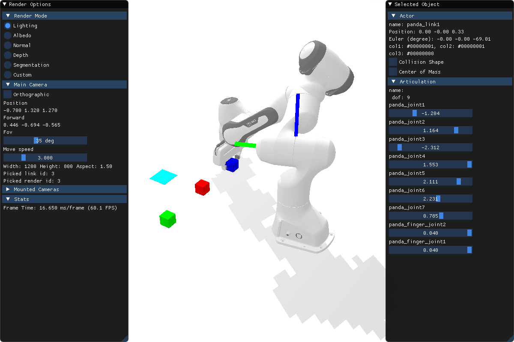

# RVAL 2022 Assignment 2
In this assignment, you will learn to apply the knowledge about SE(3) geometry and robot kinematics. Besides, it will help you get familiar with Sapien. This assignment is adpated from Prof. Hao Su's course in UCSD.

## Getting started
Please use [conda](https://www.anaconda.com/) to install the environment. Currently, only Ubuntu is fully supported for[Sapien](https://sapien.ucsd.edu/). MacOS is experimentally supported and users may encounter bugs (but it should work for this particular assignment).
```bash
conda create -n sapien anaconda python=3.7
conda activate sapien
conda install -c conda-forge gxx_linux-64==11.1.0 # For Linux
pip install sapien==0.6.0.dev0
pip3 install opencv-python
pip3 install ikfast-pybind
```
It is suggested to run the [minimal example](https://sapien.ucsd.edu/docs/0.9/tutorial/basic/minimal.html) provided by Sapien before the next step (we also provide the example as `example.py`). It is also suggested to use an editor, like VSCode or Pycharm, so that you can jump to definitions to get an idea of APIs. You may refer to the [SAPIEN 0.9 documentation](https://sapien.ucsd.edu/docs/0.9/) for this assignment.

## Instruction
The goal of this assignment is to achieve:
- hand-eye calibration
- move the end-effector to certain positions

The starter code provides these files:
- [A2.py](A2.py): run this file to debug and evaluate; not necessary to modify
- [A2_env.py](env/A2_env.py): implement this file
- [stacking_env.py](env/stacking_env.py): provide basic functions; not necessary to modify

### Hand-eye calibration
For hand-eye calibration, you need to implement `capture_calibration_data` and `compute_cam2base`.

We have provide some predefined sets of joint poses `qpos_list` in `capture_calibration_data`. For each set of joint poses (9 DoF), you need to collect two transformations `ee2base` and `marker2cam`. `ee2base` is the transformation from the end-effector to the robot base, which should be returned by `get_current_ee_pose`. `marker2cam` is the pose of the marker (chessboard) in the camera coordinate system, which should be returned by `get_current_marker_pose`. To implement the marker pose estimation, we refer you to [OpenCV tutorials](https://opencv-python-tutroals.readthedocs.io/en/latest/py_tutorials/py_calib3d/py_calibration/py_calibration.html).

Based on collected calibration data, `compute_cam2base` should estimate the transformation `cam2base` from the camera to the robot base. You might implement [Tsai](http://ieeexplore.ieee.org/iel4/202/541/00012110.pdf?arnumber=12110) or other methods.

> Please note that the setting in this project is **eye-to-hand**.

### Robot kinematics
To grasp objects, you need to implement `compute_grasp_qpos`, which returns the set of joint poses `qpos` (9 DoF) given a target position. In this assignment, each element of `qpos`, which is a list, represents the angle of a joint.

For this specific assignment, grasping a box is relatively easy. For each box, you will be provided with its observed point cloud, which is observed by the camera. Note that usually the camera can observe at least two complete faces of a box, which is roughly enough to estimate its 3D position. Since the box is axis-aligned in the camera system, which means you can acquire the position and the size of the box by computing minimal and maximal coordinates of its 3D point cloud.

To grasp an axis-aligned box with our specific two-finger gripper (see the figure below), you can set the gripper downward (rotation) and place it about above the top face of the box (position).

<div align="center">

</div>

> The distance between two fingers is larger than the size of the box. Taking the size of the gripper and two fingers into consideration, you need to move the origin of the gripper about 0.11 (you can try other values) above the center of the top face of the box.

According to the 3D position of an axis-aligned box in the camera system and `cam2base`, you can acquire the 3D position of the target box relative to the robot base. Given this position, you can compute a target pose, as illustrated above. Finally, you can call `compute_ik` to calculate `qpos` given the target end-effector (gripper) pose. Note that `compute_ik` returns the joint poses without those of two fingers. You need to append the poses of two fingers to `qpos` returned by `compute_ik`, e.g., `qpos = self.compute_ik(gripper_pose)[0]; qpos = qpos + [0.04, 0.04]`.

### Functions to implement
It is suggested to implement the following functions in order:
- [pose2mat](env/A2_env.py#L175)
- [get_current_marker_pose](env/A2_env.py#L195)
- [capture_calibration_data](env/A2_env.py#L217)
- [compute_cam2base](env/A2_env.py#L237)
- [compute_pose_distance](env/A2_env.py#L263)
- [compute_grasp_qpos](env/A2_env.py#L278)

## Hints
- `qpos` refers to the set of joint poses. The robot is controlled by specifying all the joint poses. The DoF of the robot used in the assignment is 9. The 7th joint is the end-effector. The 8th and the 9th joints are two fingers.
- You can check the details of the robot by clicking on it. The example is illustrated in the figure. `qpos` can be found on the right panel (Articulation) of the interface.

- To articulate a robot, you can use `self.robot.set_qpos(qpos)`. The function will set the joint poses to the target ones.
- If you do not call `self.step()`, the world is just rendered instead of being simulated.
- The pose of an object is represented by the class `Pose` in Sapien. It has two attributes: `p` for 3D position and `q` for 4D quaternion.
- The camera used in the assignment is an RGB-D camera.
- The boxes are axis-aligned in both the camera and the world (robot base) coordinate system.
- If you fail to implement hand-eye calibration, you can use GT `cam2base` for robot kinematics.
- Feel free to use OpenCV functions and the library you implemented in Assignment 1 to make your life easier. If you import other files in `A2_env.py`, submit them together.

## Grading
The assignment will be evaluated by running `A2.py` to check the correctness. If you only manage to achieve one objective (hand-eye calibration or robot kinematics), you will receive half of the full score. It is not necessary to import extra libraries. You will also lose points if you use extra libraries like `scipy` and `transform3d`. Late submission will also lose points.

## Turning it in

- The deadline of assignment 2 is November 5th, 12PM (UTC+8).
- Submit `A2_env.py` and a (very simple) `readme.md` with self-evaluation results in a single file to the [school course website](http://course.pku.edu.cn). Name your folder as `yourID_yourname` so you should submit `yourID_yourname.zip`.


